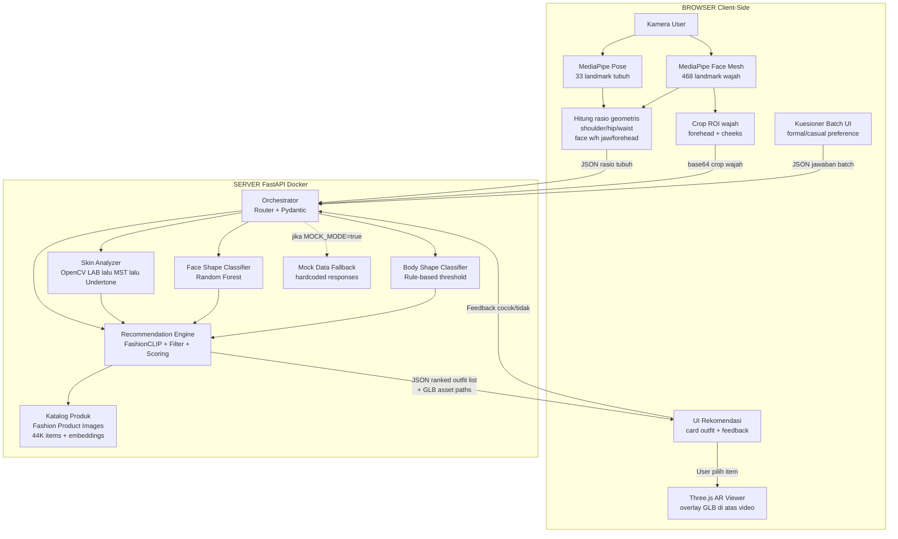

# PRD — COBA (Cocokkan Outfit Sesuai Badan Anda)

> Product Requirements Document untuk Metodologi Komprehensif penyisihan AIC COMPFEST 18.
> Fokus: AI rekomendasi gaya/outfit berdasarkan karakter personal + AR try-on sebagai validasi visual.
> **Fitur sizing/ukuran sudah dihapus dari scope.**

---

## BAGIAN 1 — Dataset Lengkap per Fitur

### a. Skin Tone & Undertone Detection

| Dataset | Jumlah Data | Isi / Kolom Penting | Lisensi | Link |
| :--- | :--- | :--- | :--- | :--- |
| **Fitzpatrick17k** | 16.577 gambar | Gambar dermatologis berlabel Fitzpatrick Skin Type (I sampai VI), kondisi kulit, dan label diagnostik | CC BY-NC-SA 4.0 | [Kaggle](https://www.kaggle.com/datasets/thomasdubail/fitzpatrick17k-photos-only), [HuggingFace](https://huggingface.co/datasets/mattmdjaga/fitzpatrick17k) |
| **Monk Skin Tone Examples (MST-E)** | 1.515 gambar | Foto berlabel 10-point Monk Skin Tone (MST) scale, dikurasi Google dan TONL untuk fairness benchmarking | CC BY 4.0 | [skintone.google](https://skintone.google), [GitHub](https://github.com/google-research-datasets/monk-skin-tone-examples) |
| **MSKCC Skin Tone Dataset** | 4.879 gambar dermoskopi | Multi-scale labels (Fitzpatrick, Monk, Pantone), plus pembacaan colorimeter | Riset / ISIC Archive | [ISIC Archive](https://challenge.isic-archive.com/) |

**Strategi COBA:** Gunakan MST-E (CC BY 4.0) sebagai ground truth referensi 10-point scale. Dari skala tersebut, petakan ke empat kategori undertone (warm, cool, neutral, olive) menggunakan rule-based mapping di LAB color space. Fitzpatrick17k digunakan untuk augmentasi dan validasi keragaman warna kulit.

**Pemetaan undertone ke palet warna pakaian:** Buat tabel lookup manual berdasarkan teori seasonal color analysis (Spring/Summer/Autumn/Winter), di mana setiap undertone dipasangkan ke palet warna yang paling cocok (complementary) dan paling buruk (clash). Tabel ini menjadi filter di recommendation engine.

---

### b. Body Shape Classification

| Dataset | Jumlah Data | Isi / Kolom Penting | Lisensi | Link |
| :--- | :--- | :--- | :--- | :--- |
| **BodyM** | 8.978 siluet (2.505 subjek) | Siluet depan dan samping, 14 ukuran tubuh dalam cm (chest, waist, hip, inseam, dll), tinggi, berat | AWS Open Data (terbuka) | [AWS Registry](https://registry.opendata.aws/bodym/) |
| **Body Measurements Dataset** | 6.068 baris | Pengukuran tubuh (chest, waist, hips, height, weight) plus label body shape (Hourglass, Pear, Apple, Rectangle, Inverted Triangle) | CC0 | [Kaggle](https://www.kaggle.com/datasets/yasserh/body-measurements-dataset) |
| **Style4BodyShape** | Referensi riset | Dataset untuk klasifikasi 5 body shape (Rectangle, Triangle, Inverted Triangle, Hourglass, Apple), dipakai dalam paper DL-EWF | Riset | [GitHub](https://github.com/AemikaChow/DL-EWF) |
| **Roboflow Woman Body Shape** | 500+ gambar beranotasi | Gambar berlabel body shape dengan bounding box untuk deteksi visual | Roboflow (terbuka) | [Roboflow Universe](https://universe.roboflow.com/search?q=body+shape) |

**Strategi COBA:** Klasifikasi body shape TIDAK menggunakan gambar, melainkan menggunakan rasio dari landmark tubuh (shoulder width, waist approx, hip width) yang diekstrak dari MediaPipe Pose. Rasio ini dicocokkan ke rule-based classifier dengan threshold:
- **Hourglass:** bust ≈ hip, waist jauh lebih kecil
- **Pear (Triangle):** hip > bust
- **Apple (Inverted Triangle):** bust > hip
- **Rectangle:** bust ≈ waist ≈ hip

Body Measurements Dataset (CC0) digunakan untuk melatih dan memvalidasi threshold rasio ini.

---

### c. Face Shape Classification

| Dataset | Jumlah Data | Isi / Kolom Penting | Lisensi | Link |
| :--- | :--- | :--- | :--- | :--- |
| **Face Shape Dataset** | 5.000 gambar | Foto selebriti dikategorikan ke 5 kelas (Heart, Oblong, Oval, Round, Square), 1.000 per kelas, split train/test | Terbuka (Kaggle) | [Kaggle](https://www.kaggle.com/datasets/niten19/face-shape-dataset) |
| **Face Shape + Dlib Features** | 5.000 gambar + CSV fitur | Dataset yang sama tapi sudah di-precompute fitur geometris (rasio wajah) via Dlib | Terbuka (Kaggle) | [Kaggle](https://www.kaggle.com/datasets/niten19/face-shape-classification-w-cv2-and-dlib-features) |
| **Face Images with Landmarks** | 6.400+ gambar | Titik landmark wajah (mata, hidung, mulut) sudah dianotasi, bisa dipakai melatih shape detector | Terbuka (Kaggle) | [Kaggle](https://www.kaggle.com/datasets/drgilermo/face-images-with-marked-landmark-points) |

**Strategi COBA:** Gunakan MediaPipe Face Mesh (468 titik landmark) di browser untuk mengekstrak fitur geometris wajah secara realtime. Hitung rasio penting dari landmark, antara lain face width-to-height ratio, jaw width-to-forehead width ratio, dan cheekbone prominence. Lalu klasifikasikan ke 5 bentuk menggunakan Random Forest yang dilatih pada Face Shape Dataset.

Referensi implementasi: [Face-Shape-Detection (GitHub)](https://github.com/akashchoudhary436/Face-Shape-Detection) menggunakan MediaPipe + Random Forest dan mencapai akurasi tinggi.

---

### d. Outfit Compatibility / Outfit Scoring

| Dataset | Jumlah Data | Isi / Kolom Penting | Lisensi | Link |
| :--- | :--- | :--- | :--- | :--- |
| **Polyvore Outfits** | 21.889 outfit | Pasangan item pakaian yang cocok, dipakai untuk belajar kompatibilitas antar item (FITB, compatibility prediction) | CC BY 4.0 (versi HuggingFace) | [GitHub](https://github.com/xthan/polyvore-dataset), [HuggingFace](https://huggingface.co/datasets/OpenDataLab/Polyvore_Outfits) |
| **Fashionpedia** | 48.825 gambar | 27 kategori pakaian, 294 atribut halus (material, pattern, style), mask segmentasi | CC BY 4.0 (anotasi) | [Download](https://fashionpedia.github.io/home/Fashionpedia_download.html) |
| **Marqo DeepFashion Multimodal** | Besar | Gambar plus deskripsi teks, siap pakai untuk model retrieval multimodal | Terbuka (HF) | [HuggingFace](https://huggingface.co/datasets/Marqo/deepfashion-multimodal) |

**Strategi COBA:** Gunakan FashionCLIP embedding untuk menghitung similarity score antar item dalam satu outfit. Polyvore Outfits dipakai untuk fine-tune atau memvalidasi compatibility model. Fashionpedia digunakan sebagai sumber atribut halus (material, pattern) yang memperkaya rekomendasi berbasis kuesioner.

---

### e. Katalog Produk Fesyen Utama

| Dataset | Jumlah Data | Isi / Kolom Penting | Lisensi | Link |
| :--- | :--- | :--- | :--- | :--- |
| **Fashion Product Images** | 44.000 produk | `styles.csv` dengan masterCategory, subCategory, articleType, **baseColour**, season, **usage** (Formal, Casual, Sports), gender | **CC0 Public Domain** | [Versi besar](https://www.kaggle.com/datasets/paramaggarwal/fashion-product-images-dataset), [Versi kecil](https://www.kaggle.com/datasets/paramaggarwal/fashion-product-images-small) |

**Konfirmasi: Fashion Product Images tetap menjadi katalog utama.** Alasannya:
1. Lisensi CC0 yang paling bersih untuk repo GitHub public
2. Kolom `usage` langsung mendukung filter kuesioner (formal/casual/sports)
3. Kolom `baseColour` langsung bisa dicocokkan ke palet warna undertone
4. `masterCategory` sudah memisahkan Apparel dari Accessories
5. 44.000 produk cukup besar untuk MVP penyisihan

Untuk aksesoris wajah, tetap gunakan:
- [Glasses and Coverings](https://www.kaggle.com/datasets/mantasu/glasses-and-coverings) (4 kelas, CC)
- [Face Attributes Grouped](https://www.kaggle.com/datasets/mantasu/face-attributes-grouped) (5 grup, 1.200 gambar/sub-kategori)

---

### f. Aset 3D untuk AR Try-On

**Strategi MVP yang paling realistis untuk penyisihan:**

| Prioritas | Pendekatan | Deskripsi | Kesiapan MVP |
| :--- | :--- | :--- | :--- |
| **1 (Utama)** | Aksesoris wajah (kacamata, topi) | Paling presisi karena face landmark stabil. Aset GLB dari Sketchfab CC0/CC BY. | Tinggi — bisa jadi demo paling meyakinkan |
| **2 (Showcase)** | Pakaian atas (jaket, hoodie, kaos) | Overlay 3D di atas body pose. Gunakan aset dari Sketchfab CC BY dan/atau generate via TripoSR (MIT). | Sedang — butuh calibration pose-to-mesh |
| **3 (Stretch)** | Full outfit | Butuh rigged garment lengkap. Gunakan GarmentCodeData (riset) atau Quaternius (CC0 fantasy). | Rendah — jika waktu cukup |

Sumber aset yang sudah divalidasi (dari riset sebelumnya):

**CC0:**
- Quaternius Modular Character Outfits (FBX, glTF) — [quaternius.com](https://quaternius.com/)
- Poly Pizza (10.600+ model low poly) — [poly.pizza](https://poly.pizza/)
- Sketchfab CC0 collections — [Clothing Kit](https://sketchfab.com/3d-models/clothing-and-character-kit-10-cc0-7c733dceb2e04c4fb7e7dbd85316c1e7)

**CC BY:**
- Sketchfab tag clothing (filter Downloadable + CC Attribution) — [sketchfab.com/tags/clothing](https://sketchfab.com/tags/clothing)
- Kacamata optimized for try-on — [3D Glasses](https://sketchfab.com/3d-models/3d-glasses-optimized-for-virtual-try-on-47c0b55f61244737a998efdd0f0aa9a0)

**Generate sendiri (MIT):**
- TripoSR — foto katalog CC0 diubah jadi GLB, 6 GB VRAM — [GitHub](https://github.com/VAST-AI-Research/TripoSR)
- TRELLIS — kualitas lebih tinggi, lebih berat — [GitHub](https://github.com/microsoft/TRELLIS)

---

## BAGIAN 2 — Tech Stack & Model ML per Fitur

### a. Scan Kamera — Pose & Body Extraction

| Aspek | Detail |
| :--- | :--- |
| **Model** | MediaPipe Pose Landmarker (33 titik landmark 3D tubuh) |
| **Library** | `@mediapipe/tasks-vision` (JavaScript, berjalan di browser) |
| **Cara kerja** | Landmark diekstrak setiap frame video dari kamera. Dihitung jarak antar titik: shoulder width (index 11-12), hip width (index 23-24), waist approximasi (midpoint antara shoulder dan hip). Rasio shoulder-hip-waist menentukan body shape. |
| **Kalibrasi** | Tinggi badan user diinput manual sebagai referensi. Semua jarak pixel dinormalisasi terhadap tinggi tubuh di frame untuk mendapatkan rasio proporsional. |
| **Alasan pemilihan** | Jalan 100% di browser tanpa server inference, Apache 2.0, sudah mature dan stabil, dokumentasi lengkap dari Google. Tidak butuh GPU server. |
| **Referensi** | [MediaPipe Pose Landmarker docs](https://developers.google.com/mediapipe/solutions/vision/pose_landmarker), [Softwear (Three.js + MediaPipe)](https://github.com/TechAngelX/softwear) |

### b. Scan Kamera — Face Landmark & Face Shape

| Aspek | Detail |
| :--- | :--- |
| **Model** | MediaPipe Face Landmarker (468 titik 3D wajah) |
| **Library** | `@mediapipe/tasks-vision` (JavaScript, browser-side) |
| **Klasifikasi** | Dari 468 titik, hitung 4 rasio kunci: (1) face width / face height, (2) jaw width / forehead width, (3) cheekbone width / jaw width, (4) chin shape (angle). Rasio ini dikirim ke backend FastAPI dan diklasifikasikan ke 5 bentuk (Heart, Oblong, Oval, Round, Square) menggunakan Random Forest yang sudah dilatih offline pada Face Shape Dataset. |
| **Alasan pemilihan** | 468 titik memberi presisi tinggi untuk kalkulasi geometris. Apache 2.0. Berjalan di browser tanpa latensi network untuk capture frame. Klasifikasi Random Forest ringan dan cepat di server. |
| **Referensi** | [Face Landmarker docs](https://developers.google.com/mediapipe/solutions/vision/face_landmarker), [Face-Shape-Detection](https://github.com/akashchoudhary436/Face-Shape-Detection) |

### c. Scan Kamera — Skin Tone & Undertone Detection

| Aspek | Detail |
| :--- | :--- |
| **Pendekatan** | Hybrid: Ekstraksi ROI wajah (forehead + cheeks) di browser, lalu analisis warna di backend |
| **Library** | OpenCV (`cv2`), NumPy (Python, server-side) |
| **Cara kerja** | (1) MediaPipe Face Mesh di browser menentukan koordinat ROI (forehead dan cheek). (2) Pixel crop dikirim ke backend. (3) Backend mengonversi RGB ke CIELAB color space. (4) Hitung median L*, a*, b* dari pixel kulit. (5) Mapping ke Monk Skin Tone scale via nearest-neighbor ke referensi MST-E. (6) Dari MST, tentukan undertone (warm jika b* tinggi dan a* positif, cool jika b* rendah dan a* negatif, neutral jika keduanya dekat nol, olive jika a* sedikit negatif dengan b* sedang). |
| **Alasan pemilihan** | LAB color space memisahkan luminance dari chromaticity sehingga lebih robust terhadap variasi pencahayaan dibanding RGB atau HSV. Rule-based mapping cukup akurat untuk 4 kategori undertone dan transparan (explainable AI). |
| **Referensi** | [Monk Skin Tone scale](https://skintone.google), [OpenCV color space conversion](https://docs.opencv.org/4.x/d8/d01/group__imgproc__color__conversions.html) |

### d. Recommendation Engine — Outfit Matching

| Aspek | Detail |
| :--- | :--- |
| **Arsitektur** | Content-based filtering + FashionCLIP embedding similarity |
| **Library** | `open_clip` atau `fashion-clip` (Python), `scikit-learn`, `faiss-cpu` (untuk nearest-neighbor search) |
| **Cara kerja — Filter Layer** | Jawaban kuesioner batch dikonversi ke hard filter: (1) `usage` = Formal/Casual/Sports, (2) `gender` = Men/Women, (3) `articleType` filter (Apparel only / Accessories included). Filter ini mengeliminasi item yang pasti tidak relevan sebelum scoring. |
| **Cara kerja — Scoring Layer** | (1) Ambil FashionCLIP embedding dari setiap item yang lolos filter. (2) Hitung color compatibility score: bandingkan `baseColour` item dengan palet warna yang cocok untuk undertone user. (3) Hitung body shape compatibility: mapping rule-based antara body shape dan potongan pakaian yang flattering (misalnya, pear shape cocok A-line, hourglass cocok fitted). (4) Gabungkan semua score dengan weighted average, ranking tertinggi ditampilkan. |
| **Feedback loop** | Setiap batch kuesioner selesai, user memberi feedback cocok/tidak cocok pada rekomendasi. Feedback ini mengubah bobot filter secara intra-session (tidak disimpan permanen). |
| **Alasan pemilihan** | FashionCLIP sudah dioptimasi untuk domain fesyen dengan embedding berkualitas tinggi. Content-based filtering cocok untuk cold-start (tanpa riwayat user). Faiss memungkinkan nearest-neighbor search cepat bahkan untuk 44.000 item. |
| **Referensi** | [patrickjohncyh/fashion-clip](https://github.com/patrickjohncyh/fashion-clip), [marqo-ai/marqo-FashionCLIP](https://github.com/marqo-ai/marqo-FashionCLIP), [Dressify models](https://huggingface.co/Stylique/dressify-models) |

### e. AR Try-On — 3D Rendering di Browser

| Aspek | Detail |
| :--- | :--- |
| **Library utama** | Three.js (JavaScript) |
| **Library pendukung** | `@mediapipe/tasks-vision` (pose + face tracking), GLTFLoader (memuat model 3D) |
| **Cara kerja (aksesoris wajah)** | Face Landmarker memberikan 468 titik 3D. Model kacamata/topi GLB diposisikan berdasarkan landmark mata (index 33, 263) dan hidung (index 1). Rotasi mengikuti orientasi wajah. |
| **Cara kerja (pakaian atas)** | Pose Landmarker memberikan shoulder dan hip landmark. Model pakaian GLB diposisikan di antara shoulder kiri-kanan, di-scale berdasarkan jarak shoulder pixel. Rotasi mengikuti orientasi torso. |
| **Format aset** | glTF 2.0 / GLB dengan kompresi DRACO untuk loading cepat |
| **Alasan pemilihan** | Three.js adalah standar industri untuk 3D di browser, punya ekosistem besar, dan integrasi native dengan WebGL. Berjalan tanpa plugin. GLB adalah format standar untuk web 3D. |
| **Referensi** | [Three.js docs](https://threejs.org/docs/), [Softwear (React+Three.js+MediaPipe)](https://github.com/TechAngelX/softwear), [bensonruan/Virtual-Glasses-Try-on](https://github.com/bensonruan/Virtual-Glasses-Try-on), [breathingcyborg/mediapipe-face-effects](https://github.com/breathingcyborg/mediapipe-face-effects) |

### f. Backend Orchestrator

| Aspek | Detail |
| :--- | :--- |
| **Framework** | FastAPI (Python 3.11), synchronous REST API |
| **Validasi** | Pydantic v2 untuk request/response schema |
| **Server** | Uvicorn |

**Endpoint yang dibutuhkan:**

| Method | Path | Fungsi |
| :--- | :--- | :--- |
| POST | `/api/v1/analyze/skin` | Terima crop wajah (base64), kembalikan Monk Skin Tone + undertone + palet warna cocok |
| POST | `/api/v1/analyze/face-shape` | Terima rasio landmark wajah (JSON), kembalikan klasifikasi bentuk wajah + rekomendasi aksesoris |
| POST | `/api/v1/analyze/body-shape` | Terima rasio landmark tubuh (JSON), kembalikan klasifikasi body shape + rekomendasi potongan pakaian |
| POST | `/api/v1/recommend` | Terima profile lengkap (undertone + body shape + face shape + jawaban kuesioner), kembalikan ranked list rekomendasi outfit |
| POST | `/api/v1/recommend/feedback` | Terima feedback cocok/tidak cocok, kembalikan updated recommendations |
| GET | `/api/v1/catalog/{item_id}` | Ambil detail produk termasuk path aset 3D (GLB) untuk AR viewer |
| GET | `/api/v1/health` | Health check |

**Mock Data Mode:** Setiap endpoint punya flag `MOCK_MODE=true` di environment variable. Jika aktif, endpoint mengembalikan data dummy yang sudah di-hardcode (tanpa kamera/inferensi) agar juri bisa menguji alur lengkap tanpa hardware.

### g. Frontend

| Aspek | Detail |
| :--- | :--- |
| **Framework** | Next.js (App Router) + Tailwind CSS |
| **Integrasi MediaPipe** | Semua inferensi MediaPipe (Pose + Face) berjalan **client-side** di browser. Alasannya: (1) Menghindari latensi upload video frame ke server, (2) MediaPipe WASM sudah dioptimasi untuk browser, (3) Menjaga privasi karena frame kamera tidak pernah meninggalkan perangkat user. |
| **Alur data** | Browser menangkap frame kamera, MediaPipe mengekstrak landmark, frontend menghitung rasio geometris, lalu mengirim **hanya rasio/angka** (bukan gambar) ke backend FastAPI. Satu-satunya gambar yang dikirim ke server adalah crop kecil region wajah untuk analisis warna kulit. |
| **3D / AR** | Three.js canvas di-overlay di atas video kamera feed. Model GLB dimuat dari static assets atau CDN. |

---

## BAGIAN 3 — Diagram Alur Integrasi Sistem

### Penjelasan Alur Data

**Step 1 — Scan (client-side):**
User membuka kamera. MediaPipe Pose dan Face Mesh berjalan di browser secara bersamaan. Landmark diekstrak setiap frame. Frontend menghitung rasio geometris dari landmark (bukan mengirim gambar mentah). Hanya crop kecil wajah (forehead + cheeks, sekitar 100x100px) yang dikirim ke server untuk analisis warna kulit.

**Step 2 — Analisis (server-side):**
Backend FastAPI menerima tiga payload: (1) rasio tubuh untuk body shape classification, (2) rasio wajah untuk face shape classification, (3) crop wajah untuk skin tone/undertone detection. Ketiga analisis berjalan paralel di satu synchronous request. Hasilnya adalah profil personal user (body shape + face shape + undertone + palet warna).

**Step 3 — Kuesioner + Rekomendasi (client lalu server lalu client):**
User menjawab kuesioner per batch di frontend. Jawaban dikirim ke backend bersama profil personal. Recommendation engine melakukan hard filter (usage, gender, articleType), lalu color compatibility scoring (undertone vs baseColour), lalu body shape compatibility scoring, lalu FashionCLIP similarity ranking. Hasil berupa ranked list outfit items.

**Step 4 — AR Try-On (client-side):**
User memilih item rekomendasi. Frontend memuat model GLB dari static asset. Three.js me-render model di atas video kamera, diposisikan berdasarkan pose/face landmark yang sudah berjalan realtime. User bisa tekan next untuk ganti item, atau kembali ke kuesioner untuk batch berikutnya.

**Mock Data Mode:**
Jika `MOCK_MODE=true`, semua endpoint mengembalikan response dummy yang sudah di-hardcode. Frontend tetap menampilkan UI lengkap dengan data palsu. Ini memastikan juri bisa menguji alur tanpa kamera atau GPU.
