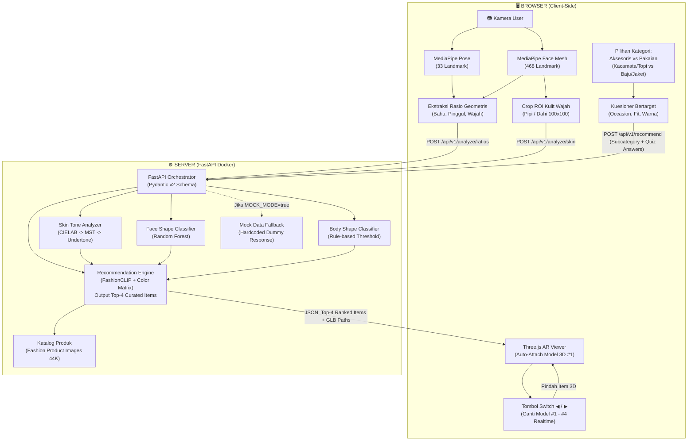

# PRD — COBA (Cocokkan Outfit Sesuai Badan Anda)

> **Product Requirements Document (PRD)**
> Status: Production-Ready Baseline (Penyisihan AIC COMPFEST 18)  
> Fokus Inovasi: AI Rekomendasi Busana Berbasis Karakter Personal (Skin Undertone, Body Shape, Face Shape, Occasion) + AR Visual Validation  
> *Catatan Scope: Fitur rekomendasi ukuran (sizing calibration) telah sepenuhnya dihapus sesuai ADR-005.*

---

## 1. Problem Statement & Solusi

### Problem Statement
Pembeli pakaian di Indonesia menghadapi masalah ketidakcocokan gaya dan karakter personal (*style-fit mismatch*) saat berbelanja daring maupun luring. Tanpa pemahaman atas *undertone* kulit (yang menyebabkan warna pakaian *wash out*), proporsi bentuk tubuh, dan bentuk wajah untuk aksesoris, konsumen kerap salah memilih. Akibatnya timbul *silent dissatisfaction*, pakaian mengendap tanpa dipakai, rating toko anjlok, serta kelelahan memilih (*choice fatigue*).

### Solusi
COBA (Cocokkan Outfit Sesuai Badan Anda) menghadirkan platform cerdas yang menggabungkan:
1. **Camera Personal Profiling (Client-Side MediaPipe)**: Ekstraksi fitur visual (warna kulit, landmark wajah 468 titik, dan rasio tubuh 33 titik).
2. **Category Selection & Targeted Questionnaire**: Alur kustomisasi bertingkat (Aksesoris vs Pakaian) sebelum kuesioner ringkas.
3. **Top-4 Curated Recommendation Engine (FastAPI + FashionCLIP)**: Mesin rekomendasi yang menghasilkan 4 opsi terkurasi berdasarkan profil personal & kuesioner.
4. **Auto-Attached 3D AR Try-On with Switch Navigation (Three.js WebGL)**: Rekomendasi #1 otomatis terpasang ke badan/wajah secara realtime, dilengkapi tombol navigasi Kiri-Kanan (*Switch*) untuk mencoba 4 varian rekomendasi secara instan.

---

## 2. Alur Pengguna (User Journey & Interaksi)

```
[1. Pemilihan Kategori Aksesoris]
├── [Kacamata (Glasses / Eyewear)] ──► Aktif (Face Mesh Landmark Tracking)
├── [Topi (Hats / Headwear)]        ──► Aktif (Head Contour Tracking)
└── [Pakaian (Baju / Jaket)]       ──► Locked (Tahap 2: Memerlukan Full-Body Pose Tracking)
                 │
                 ▼
[2. Scan Kamera Personal Profiling Wajah & Kulit]
(Deteksi Realtime: Skala Kulit Monk + Undertone + Bentuk Wajah 468 Titik)
                 │
                 ▼
[3. Kuesioner Interaktif Bertarget (Multi-Batch Unlimited)]
├── Batch 1 (Inti): Momen Acara, Siluet Bingkai/Karakter, Palet Warna
├── Batch 2 (Gaya & Vibe): Brand Style, Prioritas Kenyamanan, Rentang Budget
├── Batch 3 (Material & Tekstur): Jenis Bahan, Motif/Aksen, Fleksibilitas Outfit
└── Batch 4+ (Signature Touch): Aura Personal, Fokus Detail Hardware
                 │
                 ▼
[3.5. Cinematic AI Processing Telemetry Screen]
(Animasi pemrosesan setiap preferensi input pengguna secara berurutan + kalkulasi keserasian)
                 │
                 ▼
[4. Output Rekomendasi AI: Top-4 Curated Archetypes di 3D AR]
├── Rekomendasi #1 (The Perfect Match)  ──► OTOMATIS TERPASANG DI WAJAH/KEPALA (AR Live)
├── Rekomendasi #2 (Safe Classic / Versatile) 
├── Rekomendasi #3 (Bold Statement / Contrast)
└── Rekomendasi #4 (Modern / Trendy Variant)
                 │
                 ▼
[5. Navigasi Switch Kiri - Kanan & Reset dari Awal]
(User menekan tombol Panah Kiri/Kanan untuk berganti model AR, atau tombol Reset Scan)
```

---

## 3. Justifikasi Desain: Mengapa Output Rekomendasi Top-4? (/before-you-build)

Pemilihan **Top-4 Rekomendasi** didasarkan pada prinsip ergonomi antarmuka dan riset *consumer behavior*:

1. **Mengeliminasi *Choice Overload* & *Hick's Law***:
   - Riset McKinsey & BoF *State of Fashion 2025* mencatat 50% konsumen membatalkan belanja akibat kelelahan memilih (*choice fatigue*). Terlalu banyak opsi (> 6) memicu *choice paralysis*, sedangkan terlalu sedikit (< 3) membatasi kebebasan memilih. 4 pilihan adalah jumlah optimal untuk diproses secara kognitif dalam 3 detik.
2. **4 Arketipe Gaya Terkurasi (*The 4 Style Archetypes*)**:
   - **Opsi 1 (#1 Perfect Match)**: Skor kecocokan tertinggi (100% selaras dengan undertone, bentuk tubuh/wajah, dan kuesioner). Terpasang otomatis pertama kali.
   - **Opsi 2 (Safe Classic / Versatile)**: Nuansa warna netral/desain klasik yang aman dan serbaguna.
   - **Opsi 3 (Bold Statement / Contrast)**: Warna komplementer kontras yang mencolok namun tetap harmonis dengan undertone.
   - **Opsi 4 (Modern / Trendy Silhouette)**: Model kekinian yang proporsional dengan siluet tubuh/wajah user.
3. **Ergonomi Navigasi Kanan-Kiri di AR**:
   - User hanya memerlukan maksimal 3 kali klik tombol panah kanan untuk melihat seluruh variasi model 3D (`1 -> 2 -> 3 -> 4 -> 1` loop).
4. **Performa Memori & Rendering WebGL 60 FPS**:
   - Memuat 4 aset 3D GLB terkompresi DRACO ke memory browser hanya memakan bandwidth ~6–10 MB, menjamin transisi switch model 3D berlangsung instan tanpa *frame drop* atau lag saat demonstrasi di depan juri.

---

## 4. Dataset Lengkap & Sumber Terverifikasi (100% Active Links)

### a. Skin Tone & Undertone Detection

| Dataset / Sumber | Volume | Kolom / Metadata Kunci | Lisensi | Link Akses Terverifikasi |
| :--- | :--- | :--- | :--- | :--- |
| **Google Monk Skin Tone (MST)** | 10-Shade Scale | Nilai standar warna LAB/RGB/HEX untuk representasi inklusif 10 warna kulit manusia | CC BY 4.0 | [skintone.google](https://skintone.google/) |
| **Google SCIN Dataset** | 10.000+ citra | Citra kondisi dermatologi dengan label MST dan Fitzpatrick Skin Type | CC BY 4.0 | [GitHub google-research-datasets/scin](https://github.com/google-research-datasets/scin) |
| **Fitzpatrick17k (Official Repo)** | 16.577 citra | Repositori resmi makalah evaluasi fairness dengan anotasi Fitzpatrick Scale I–VI | Open Research | [GitHub mattgroh/fitzpatrick17k](https://github.com/mattgroh/fitzpatrick17k) |
| **ISIC Skin Tone Benchmark** | 4.800+ citra | Multi-scale clinical dermatological skin annotations | Research / ISIC | [ISIC Archive Challenge](https://challenge.isic-archive.com/) |

---

### b. Body Shape Classification

| Dataset / Sumber | Volume | Kolom / Metadata Kunci | Lisensi | Link Akses Terverifikasi |
| :--- | :--- | :--- | :--- | :--- |
| **ANSUR II (US Army Anthropometry)** | 6.000+ subjek | 93 dimensi antropometri akurat (biacromial breadth, chest, waist, hip circumference) | Public Domain / OpenLab | [OpenLab PSU ANSUR2](https://www.openlab.psu.edu/ansur2/), [GitHub senihberkay/US-Army-ANSUR-II](https://github.com/senihberkay/US-Army-ANSUR-II) |
| **BodyM Dataset (AWS Open Data)** | 8.978 siluet | Siluet depan & samping, 14 dimensi tubuh dalam cm, tinggi, berat | AWS Open Data | [AWS Open Data Registry BodyM](https://registry.opendata.aws/bodym/) |

---

### c. Face Shape Classification (Untuk Rekomendasi Aksesoris)

| Dataset / Sumber | Volume | Kolom / Metadata Kunci | Lisensi | Link Akses Terverifikasi |
| :--- | :--- | :--- | :--- | :--- |
| **Face Shape Dataset (Kaggle)** | 5.000 citra | Foto wajah berlabel 5 bentuk: Heart, Oblong, Oval, Round, Square (1.000/kelas) | Open Kaggle | [Kaggle niten19/face-shape-dataset](https://www.kaggle.com/datasets/niten19/face-shape-dataset) |
| **Face Shape Feature Dataset** | 5.000 baris | Nilai fitur geometris dan koordinat landmark wajah | MIT | [GitHub dsmlr/faceshape](https://github.com/dsmlr/faceshape) |
| **Face-Shape-Detection Reference** | Kode & Model | Implementasi MediaPipe Face Mesh + Random Forest Classifier | Open Source | [GitHub akashchoudhary436/Face-Shape-Detection](https://github.com/akashchoudhary436/Face-Shape-Detection) |
| **Face-Shape-Classification CNN** | Kode & Model | Baseline klasifikasi bentuk wajah menggunakan CNN | Open Source | [GitHub Arbaz57/Face-Shape-Classification](https://github.com/Arbaz57/Face-Shape-Classification) |

---

### d. Outfit Compatibility & Multimodal Scoring

| Dataset / Sumber | Volume | Kolom / Metadata Kunci | Lisensi | Link Akses Terverifikasi |
| :--- | :--- | :--- | :--- | :--- |
| **Polyvore Outfits (Official Repo)** | 21.889 set outfit | Relasi keserasian atasan, bawahan, sepatu, dan aksesoris (FITB & Compatibility) | CC BY 4.0 | [GitHub xthan/polyvore-dataset](https://github.com/xthan/polyvore-dataset) |
| **Polyvore Outfits (HuggingFace)** | 21.889 set outfit | Dataset terstruktur siap konsumsi untuk visual fashion compatibility | Open Access | [HuggingFace owj0421/polyvore-outfits](https://huggingface.co/datasets/owj0421/polyvore-outfits) |
| **Fashionpedia** | 48.825 citra | 27 kategori busana, 294 atribut detail (pola, material, siluet), segmentasi | CC BY 4.0 | [Fashionpedia Download Page](https://fashionpedia.github.io/home/Fashionpedia_download.html) |
| **Marqo DeepFashion Multimodal** | Ratusan ribu | Pasangan teks-gambar siap pakai untuk retrieval multimodal | Open Access | [HuggingFace Marqo/deepfashion-multimodal](https://huggingface.co/datasets/Marqo/deepfashion-multimodal) |

---

### e. Katalog Produk Fesyen Utama

| Dataset / Sumber | Volume | Kolom / Metadata Kunci | Lisensi | Link Akses Terverifikasi |
| :--- | :--- | :--- | :--- | :--- |
| **Fashion Product Images (Full)** | 44.000 produk | `styles.csv` memuat `id`, `gender`, `masterCategory`, `subCategory`, `articleType`, `baseColour`, `season`, `usage` (Formal, Casual, Sports, Ethnic) | **CC0 Public Domain** | [Kaggle paramaggarwal/fashion-product-images-dataset](https://www.kaggle.com/datasets/paramaggarwal/fashion-product-images-dataset) |
| **Fashion Product Images (Small)** | 44.000 produk | Versi gambar terkompresi (60x80px / 240x320px) ideal untuk testing lokal cepat | **CC0 Public Domain** | [Kaggle paramaggarwal/fashion-product-images-small](https://www.kaggle.com/datasets/paramaggarwal/fashion-product-images-small) |

---

### f. Aset 3D & Repositori Implementasi AR

| Komponen / Sumber | Format / Isi | Lisensi | Link Akses Terverifikasi |
| :--- | :--- | :--- | :--- |
| **Virtual Glasses & Hats Try-On** | Three.js + MediaPipe Face Mesh (realtime AR kacamata & topi 60fps) | MIT | [GitHub bensonruan/Virtual-Glasses-Try-on](https://github.com/bensonruan/Virtual-Glasses-Try-on) |
| **Procedural 3D Generators** | Dynamic Three.js parametric meshes (Baseball Cap, Bucket Hat, Beanie, Fedora, Beret, Newsboy, Wayfarer, Aviator, Round, Cat-Eye) | Custom Built | In-Tree `client/src/components/ARCanvasViewer.tsx` |
| **MediaPipe Face Effects** | Shader & 3D overlay wajah di browser | MIT | [GitHub breathingcyborg/mediapipe-face-effects](https://github.com/breathingcyborg/mediapipe-face-effects) |
| **Softwear (Body Tracking)** | React + Three.js + MediaPipe Pose virtual try-on engine | Open Source | [GitHub TechAngelX/softwear](https://github.com/TechAngelX/softwear) |
| **Quaternius Outfits** | Model modular pakaian 3D rigged | CC0 | [quaternius.com](https://quaternius.com/) |
| **Poly Pizza** | 10.600+ model low-poly 3D (kacamata, topi, aksesoris) | CC0 / Free | [poly.pizza](https://poly.pizza/) |
| **Sketchfab 3D Clothing** | Model 3D pakaian format GLB/glTF | CC BY | [Sketchfab Tags Clothing](https://sketchfab.com/tags/clothing) |
| **TripoSR (3D Gen from 2D)** | Model fast single-image 3D mesh generator (< 6GB VRAM) | MIT | [GitHub VAST-AI-Research/TripoSR](https://github.com/VAST-AI-Research/TripoSR) |
| **Microsoft TRELLIS** | High-fidelity 3D asset generator | MIT | [GitHub microsoft/TRELLIS](https://github.com/microsoft/TRELLIS) |
| **Google MediaPipe Vision** | Core vision framework (Pose, Face Mesh) | Apache 2.0 | [GitHub google-ai-edge/mediapipe](https://github.com/google-ai-edge/mediapipe) |
| **Three.js Engine** | JavaScript 3D Library | MIT | [threejs.org Docs](https://threejs.org/docs/) |

---

## 5. Arsitektur Teknis & Model ML per Fitur

```
                               ┌───────────────────────────────────────────────┐
                               │             BROWSER (Client-Side)             │
                               │        Next.js + Tailwind + Three.js          │
                               │                                               │
                               │  1. Camera Input (Webcam Video Stream)        │
                               │  2. MediaPipe Pose (33 Landmarks) -> Ratios   │
                               │  3. MediaPipe Face (468 Landmarks) -> Ratios  │
                               │  4. Category & Subcategory Interactive Choice │
                               │  5. Targeted Batch Questionnaire UI           │
                               │  6. Three.js Auto-Attached 3D AR Viewer       │
                               │  7. Left/Right Navigation Switch UI           │
                               └───────────────────────┬───────────────────────┘
                                                       │ HTTP REST (JSON + Base64)
                                                       ▼
                               ┌───────────────────────────────────────────────┐
                               │             SERVER (FastAPI Docker)           │
                               │               Synchronous Engine              │
                               ├───────────────────────────────────────────────┤
                               │ A. Skin Analyzer (CIELAB Space -> MST Scale)  │
                               │ B. Body Shape Classifier (Ratio Rule Engine)  │
                               │ C. Face Shape Classifier (Random Forest)      │
                               │ D. Recommendation Engine (FashionCLIP + Rule) │
                               │    -> Generates Top-4 Ranked Outfit Models    │
                               │ E. Mock Data Fallback Mode (MOCK_MODE=true)   │
                               └───────────────────────────────────────────────┘
```

### Rincian Modul:

1. **Scan Kamera & Ekstraksi Ciri (Client-Side)**
   - **Teknologi**: `@mediapipe/tasks-vision` (JavaScript/WASM).
   - **Alur**: Frame kamera diproses di browser tanpa upload video mentah ke server (menjamin privasi 100% dan zero latency). Browser mengekstrak landmark tubuh dan wajah, menghitung rasio geometris, serta mengambil crop kecil (100x100px) area pipi/dahi.

2. **Skin Tone & Undertone Classifier (Server-Side)**
   - **Teknologi**: OpenCV (`cv2`), NumPy.
   - **Logika**: Konversi ROI wajah ke ruang warna CIELAB. Menghitung jarak Euclidean ke 10 nilai acuan Monk Skin Tone scale. Memetakan nilai $a^*$ dan $b^*$ ke 4 kategori undertone (Warm, Cool, Neutral, Olive), yang kemudian diasosiasikan dengan palet warna rekomendasi musiman.

3. **Body & Face Shape Classifier (Server-Side)**
   - **Body Shape**: Menghitung rasio bahu terhadap pinggul dan pinggang (Hourglass: $\approx 1.0$ dengan pinggang ramping; Pear: hip > shoulder; Apple/Inverted Triangle: shoulder > hip; Rectangle: rasio sejajar).
   - **Face Shape**: Random Forest classifier mengklasifikasikan rasio wajah ke dalam 5 kategori bentuk untuk menentukan rekomendasi tipe kacamata (misal: frame bulat untuk wajah kotak/persegi, frame tegas untuk wajah bulat).

4. **Recommendation Engine (Server-Side)**
   - **Teknologi**: `marqo-FashionCLIP` / `patrickjohncyh/fashion-clip`, `scikit-learn`, `faiss-cpu`.
   - **Tahap 1 (Hard Filter)**: Memfilter dataset berdasarkan sub-kategori terpilih (Kacamata/Topi/Baju/Jaket), gender, dan occasion kuesioner.
   - **Tahap 2 (Soft Scoring)**: Memberikan skor kecocokan warna (*Color Compatibility*) antara `baseColour` produk dengan palet undertone user, ditambah bobot kecocokan siluet busana (*Body Shape Fit*) dan bentuk wajah (*Face Shape Fit*).
   - **Tahap 3 (Top-4 Ranking)**: Mengembalikan 4 set model terkurasi dengan metadata dan path aset 3D GLB.

5. **Visual Validation AR & Switch Navigation (Client-Side)**
   - **Teknologi**: Three.js + WebGL.
   - **Implementasi**: Model 3D rekomendasi #1 otomatis di-attach ke tubuh/wajah realtime. User dapat menekan tombol panah Kanan/Kiri untuk berganti ke rekomendasi #2, #3, atau #4 secara instan.

---

## 6. Diagram Alur Integrasi Sistem



---

## 7. Jadwal & Urutan Prioritas Pengerjaan

```
HARI 1-2: Classification Pipeline (Komponen Inti AI)
├── Skin Tone Detection (OpenCV LAB + Monk Skin Tone scale)
├── Face Shape Classification (MediaPipe Face Mesh + Random Forest)
├── Body Shape Classification (MediaPipe Pose + ANSUR II calibrated ratios)
└── Unit testing & validasi akurasi classifier

HARI 2-3: Recommendation Engine (FastAPI Backend)
├── Pre-compute FashionCLIP embeddings untuk katalog Fashion Product Images
├── Filter layer (Kategori/Sub-kategori, Occasion, Fit) & color palette matching
├── Logika kurasi Top-4 Archetypes
└── Integrasi endpoint REST API: /api/v1/analyze & /api/v1/recommend

HARI 3-4: Frontend Next.js + AR Kacamata / Baju Auto-Attach & Switch
├── Implementasi UI scanner kamera, Category Selector, & Kuesioner
├── Integrasi Three.js AR 3D auto-attach model #1 pada wajah/tubuh
├── Komponen UI tombol navigasi Kiri-Kanan (Switch Model 3D)
└── End-to-end user flow testing

HARI 4-5: Docker, Mock Mode, Video & Final Submission
├── docker-compose.yml teruji lokal
├── Fitur Toggle Mock Data Mode (MOCK_MODE=true) untuk pengujian juri
├── Rekam Video Proof of Work (7 menit tanpa cut)
├── Rekam Video Promosi (5 menit)
└── Finalisasi naskah Proposal PDF
```
