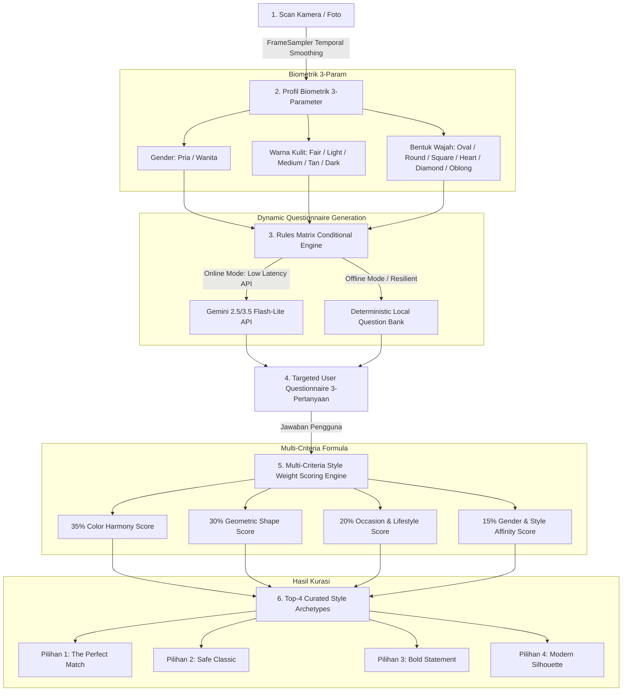

# Alur Analisis Kuesioner Cerdas & Personalisasi Gaya (COBA AI Engine)

Dokumen ini menjelaskan arsitektur logika dan alur kerja pemrosesan **Kuesioner Dinamis (Dynamic Questionnaire Engine)** serta bagaimana hasil analisis AI Face Biometrics 3-Parameter mempengaruhi pembuatan pertanyaan kuesioner dan formula penentuan rekomendasi **Top-4 Curated Style Archetypes**.

---

## 🧭 Diagram Alur Sistem (End-to-End Flow)

---

## 🎯 1. Matriks Aturan Kondisional (Conditional Rules Matrix)

Setiap pertanyaan yang digenerate oleh Gemini API maupun *Local Rule Bank* dipandu oleh matriks kondisional 3 dimensi:

### A. Dimensi Gender (Pria vs Wanita)
| Gender | Fokus Prioritas Pertanyaan | Konteks Gaya & Material |
| :--- | :--- | :--- |
| **Pria (Male)** | • Ketegasan garis rahang & pelipis • Kepraktisan mobilitas luar ruangan (outdoor) • Daya tahan terhadap keringat & gesekan | Siluet tegas, *clean/rugged*, material kokoh (Beta Titanium, Matte Acetate, Heavyweight Cotton), kerah tegas penyeimbang rahang. |
| **Wanita (Female)** | • Keselarasan dengan riasan/makeup wajah • Proporsi keanggunan siluet bingkai/kerah • Fleksibilitas transisi gaya *day-to-night* (kerja ke kafe) | Siluet melengkung anggun, aksen chic, warna bernuansa lembut/mewah (Rose Gold, Champagne, Burgundy, Drape Fabric). |

---

### B. Dimensi Warna Kulit (Dark/Tan vs Fair/Light vs Medium)
| Kategori Warna Kulit | Skala Monk (MST) | Pendekatan Palet & Pencahayaan | Rekomendasi Aksen Warna |
| :--- | :--- | :--- | :--- |
| **Tan / Dark (Sawo Matang / Gelap)** | MST 06 – MST 10 | Kontras hangat bercahaya; tahan pudar di bawah terik matahari tropis; menonjolkan kilau eksotis kulit. | Gold, Champagne, Warm Amber, Tortoiseshell Emas, Terracotta, Olive Bronze, Deep Ochre. |
| **Fair / Light (Sangat Terang / Terang)** | MST 01 – MST 04 | Kontras sejuk berdimensi; mencegah kesan pucat (*wash-out*); menonjolkan kesegaran visual. | Silver Steel, Gunmetal, Deep Navy, Sapphire, Rose Gold Pastel, Charcoal Grey, Burgundy Wine. |
| **Medium (Sedang / Langsat)** | MST 05 | Fleksibilitas tinggi dalam perpaduan spektrum hangat maupun netral sejuk. | Havana Dark Tortoise, Matte Gunmetal, Warm Beige, Translucent Frosted Crystal. |

---

### C. Dimensi Bentuk Wajah (Geometri Proporsional)
| Bentuk Wajah | Karakteristik Garis Wajah | Strategi Penyeimbang Geometris Kuesioner |
| :--- | :--- | :--- |
| **Round (Bulat)** | Pipi penuh, rasio lebar-panjang seimbang | Pertanyaan menawarkan sudut tegas horizontal (Rectangular, Sharp Square, Upward Browline) untuk ilusi wajah lebih tirus. |
| **Square (Kotak)** | Garis rahang kuat dan bersiku | Pertanyaan menawarkan kurva lengkung melembutkan (Round, Oval Wire, Soft Wayfarer) agar proporsi rahang tampak seimbang. |
| **Heart (Hati)** | Dahi lebar dengan dagu meruncing | Pertanyaan menawarkan aksen bawah lebih lebar (Bottom-Weighted Aviator, Thin Rimless) untuk menyeimbangkan dagu lancip. |
| **Oblong (Lonjong)** | Bidang vertikal wajah memanjang | Pertanyaan menawarkan lensa berdimensi tinggi (Tall Lens Oversized, Double Bridge, Thick Browline) untuk membagi bidang vertikal. |
| **Oval & Diamond** | Simetris proporsional seimbang | Eksplorasi gaya bebas: Classic Timeless, Modern Hexagon, Retro Round, hingga Avant-Garde. |

---

## 🧮 2. Formula Matematis Skoring Multi-Kriteria

Setiap produk dalam katalog dihitung skor kecocokannya ($S_{\text{total}} \in [0, 100]$) melalui formula bobot:

$$S_{\text{total}} = 0.35 \cdot S_{\text{color}} + 0.30 \cdot S_{\text{shape}} + 0.20 \cdot S_{\text{occasion}} + 0.15 \cdot S_{\text{affinity}}$$

Di mana:
1. **$S_{\text{color}}$ (35% - Harmoni Warna & Kulit):**
   * Kecocokan warna dasar produk terhadap undertone & kategori Monk Skin Tone.
   * Bonus $+4.0$ poin jika warna produk cocok dengan pilihan palet suasana (*Color Mood*) dari kuesioner.
2. **$S_{\text{shape}}$ (30% - Proporsi Geometri Wajah):**
   * Kecocokan tipe model terhadap *flatteringFaceShapes* hasil analisis biometrik.
   * Skor $97.0$ jika *perfect flattering match*, $94.0$–$95.0$ untuk bentuk komplementer.
3. **$S_{\text{occasion}}$ (20% - Konteks Acara & Kenyamanan):**
   * Kecocokan atribut penggunaan produk (`Casual`, `Formal`, `Sports`, `Party`) dengan jawaban pengguna.
   * Bonus $+12.0$ poin untuk *exact match usage*.
4. **$S_{\text{affinity}}$ (15% - Keselarasan Gender & Preferensi Gaya):**
   * Bonus $+8.0$ poin untuk keselarasan gender produk (`Men`, `Women`, `Unisex`).
   * Bonus $+4.0$ poin untuk kecocokan preferensi gaya (*Minimalist*, *Streetwear*, *Classic*, *Avant-Garde*).
   * Bonus $+3.0$ poin untuk material preferensi (*Titanium*, *Acetate*, *Stainless Steel*, *Cotton*).

---

## 🌟 3. Kurasi 4 Arketipe Gaya (Top-4 Archetypes)

Setelah seluruh kandidat produk diskor dan diurutkan secara menurun ($S_{\text{total}}$ tertinggi), sistem mengelompokkan 4 produk dengan model berbeda ke dalam 4 persona gaya unik:

1. 🥇 **Pilihan 1: The Perfect Match (#1 Best Fit)**
   * Produk dengan skor kecocokan tertinggi secara keseluruhan. Merepresentasikan harmoni sempurna antara warna kulit, bentuk wajah, dan kebutuhan acara utama.
2. 🥈 **Pilihan 2: Safe Classic (Pilihan Serbaguna)**
   * Produk dengan siluet abadi (*timeless* seperti Classic Wayfarer / Regular Fit Shirt) yang fleksibel digunakan di berbagai suasana harian tanpa risiko salah kostum.
3. 🥉 **Pilihan 3: Bold Statement (Aksen Kontras)**
   * Produk dengan aksen kontras yang lebih berani (*geometric frame*, warna aksen hidup, atau material berciri kuat) untuk pengguna yang ingin tampil menonjol dan percaya diri.
4. 🏅 **Pilihan 4: Modern Silhouette (Varian Kekinian)**
   * Produk dengan potongan kontemporer (*Hexagon/Octagon Wire, Oversized Fit*) yang mengikuti tren fashion global terkini.

---

## 🔬 4. Studi Kasus Nyata (Concrete Case Studies)

### Kasus A: Pengguna Pria, Kulit Sawo Matang (Tan / MST-06), Wajah Kotak (Square)
* **Kuesioner yang Dihasilkan:**
  1. *Q1 (Aktivitas Pria):* "Untuk kebutuhan aktivitas utama apa Anda memilih kacamata ini?" $\rightarrow$ Pilihan fokus pada kerja kantor vs outdoor adventure dinamis.
  2. *Q2 (Wajah Square):* "Untuk menyeimbangkan garis rahang tegas pada wajah Square Anda, karakter siluet apa yang Anda prioritaskan?" $\rightarrow$ Pilihan memprioritaskan bingkai lengkung lembut (*Round Curved*) vs *Soft Wayfarer*.
  3. *Q3 (Kulit Sawo Matang):* "Untuk memancarkan kilau eksotis kulit Tan (MST-06) Anda, nuansa palet warna apa yang Anda prioritaskan?" $\rightarrow$ Pilihan fokus pada *Gold & Amber Tortoiseshell* dan *Warm Terracotta*.
* **Hasil Rekomendasi Top-4:**
  * The Perfect Match: **Aviator Gold & Warm Amber** ($96.8\%$ match).
  * Safe Classic: **Soft Wayfarer Matte Tortoise** ($94.2\%$ match).
  * Bold Statement: **Round Wire Brushed Bronze** ($91.5\%$ match).
  * Modern Silhouette: **Geometric Octagonal Gold** ($89.8\%$ match).

### Kasus B: Pengguna Wanita, Kulit Terang (Fair / MST-02), Wajah Bulat (Round)
* **Kuesioner yang Dihasilkan:**
  1. *Q1 (Aktivitas Wanita):* "Untuk suasana penampilan harian seperti apa Anda mencari kacamata ini?" $\rightarrow$ Pilihan fokus pada *Chic Café*, *Smart Formal*, dan *Glamour Evening*.
  2. *Q2 (Wajah Round):* "Untuk memberikan ilusi kontur yang lebih terstruktur pada wajah Round Anda, siluet apa yang Anda sukai?" $\rightarrow$ Pilihan fokus pada *Rectangular Sharp* dan *Upward Cat-Eye*.
  3. *Q3 (Kulit Fair):* "Untuk menonjolkan kecerahan warna kulit Fair Anda tanpa kesan pucat, palet apa yang paling Anda sukai?" $\rightarrow$ Pilihan fokus pada *Silver Steel*, *Deep Navy*, dan *Rose Gold Pastel*.
* **Hasil Rekomendasi Top-4:**
  * The Perfect Match: **Rectangular Cat-Eye Silver & Deep Navy** ($97.2\%$ match).
  * Safe Classic: **Classic Square Acetate Gunmetal** ($93.8\%$ match).
  * Bold Statement: **Rose Gold Upward Browline** ($92.0\%$ match).
  * Modern Silhouette: **Thin Wire Hexagon Ice Blue** ($90.1\%$ match).
