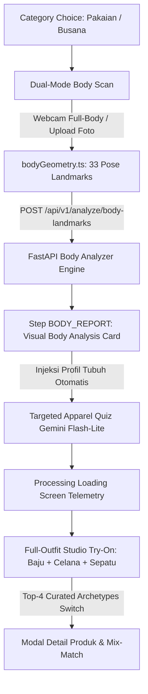

# Implementation Plan: Full-Body Styling & Virtual Try-On Engine (Baju, Celana, Sepatu)

Dokumen ini adalah rencana implementasi komprehensif dari awal hingga akhir untuk mengaktifkan **Kategori Pakaian / Busana Tubuh (Baju, Celana, dan Sepatu)** pada platform **COBA** (*Cocokkan Outfit Sesuai Badan Anda*), mengadopsi standar arsitektur yang sama dengan modul Analisis Wajah yang telah sukses dibangun.

---

## 🏛️ Arsitektur Alur Pengguna (User Journey)



---

## 📋 Tahapan Eksekusi Rinci (5 Fase Pengerjaan)

---

### 🔹 Fase 1: Input Tubuh Dual-Mode & Reposisi Interaktif (Client-Side)

#### 1. Modul Matematika Antropometri (`client/src/lib/bodyGeometry.ts`) [NEW]
* Mengekstrak koordinat landmark MediaPipe Pose (33 titik):
  * **Lebar Bahu (*Biacromial*)**: Landmark 11 (kiri) ke 12 (kanan).
  * **Lebar Pinggang (*Waist Width*)**: Estimasi titik tengah torso (jarak 11-23 dan 12-24).
  * **Lebar Pinggul (*Hip Width*)**: Landmark 23 (kiri) ke 24 (kanan).
  * **Panjang Torso**: Jarak titik tengah bahu (11–12) ke titik tengah pinggul (23–24).
  * **Panjang Kaki (*Inseam*)**: Jarak pinggul (23/24) ke lutut (25/26) dan mata kaki (27/28).
* Kalibrasi tinggi badan (input cm pengguna / estimasi rasio) $\rightarrow$ menghasilkan ukuran nyata:
  * `shoulder_width_cm`, `waist_width_cm`, `hip_width_cm`, `torso_length_cm`, `leg_length_cm`.
* Evaluasi Rasio Geometri:
  * `shoulder_to_hip_ratio`, `waist_to_hip_ratio`, `waist_to_shoulder_ratio`, `torso_to_leg_ratio`.
* *Quality Gates*: Verifikasi postur tegak, orientasi frontal ($|\text{yaw}| \le 15^\circ$), dan keterlihatan tubuh minimal dari bahu hingga mata kaki.

#### 2. Komponen Pindai Tubuh Dual-Mode (`client/src/components/BodyScan.tsx`) [NEW]
* **Mode 1 (Webcam Full-Body)**:
  * Pemandu siluet tubuh (*vertical body contour guide*) dengan 3 status: Merah (Tubuh tidak terdeteksi), Kuning (Belum mundur/kurang pas), Hijau (Pas di posisi).
  * *Auto-countdown* 3 detik saat tubuh stabil hijau.
* **Mode 2 (Upload Foto Seluruh Badan)**:
  * Menggunakan `PhotoUpload.tsx` untuk menerima file foto seluruh badan (PNG/JPG/JPEG $\le 8$MB).
* **Alat Reposisi Tubuh (`client/src/components/BodyRepositionTool.tsx`) [NEW]**:
  * Kanvas interaktif untuk *drag/pan*, *zoom in/out*, dan *rotate* agar bahu, pinggul, dan kaki tepat menempati garis siluet pemandu.

---

### 🔹 Fase 2: Backend AI Body Shape Analyzer & 3 Pilar Busana

#### 1. Kontrak Skema Pydantic (`server/app/schemas.py`) [MODIFY]
* Menambahkan skema:
  * `BodyRatiosIn`, `BodyMeasurementsIn`, `BodyLandmarkAnalysisRequest`.
  * `BodyShapeMultiOut`, `BodyPillarOut`, `FullOutfitRecommendationOut`.

#### 2. Engine Analisis Karakter Tubuh (`ai_engine/models/body_analyzer.py`) [NEW]
* **Klasifikasi 5 Bentuk Tubuh Standar Fesyen (Berbasis Dataset ANSUR II)**:
  1. **Hourglass (Jam Pasir)**: Rasio Bahu $\approx$ Pinggul ($0.95 - 1.05$), Pinggang ramping ($< 0.75 \times$ pinggul).
  2. **Pear / Triangle (Pir)**: Pinggul dominan ($\text{Hip} > 1.05 \times \text{Shoulder}$).
  3. **Inverted Triangle (Segitiga Terbalik)**: Bahu bidang ($\text{Shoulder} > 1.05 \times \text{Hip}$).
  4. **Rectangle (Persegi Panjang)**: Bahu $\approx$ Pinggang $\approx$ Pinggul (rasio lurus, pinggang tidak berlekuk).
  5. **Apple / Oval (Apel)**: Lingkar pinggang/tengah $\ge$ Bahu dan Pinggul.
* **Klasifikasi Rasio Proporsi Vertikal**:
  * `Long Torso` ($\text{Torso} > 0.48 \times \text{Tinggi Total}$), `Balanced`, `Long Legs` ($\text{Kaki} > 0.55 \times \text{Tinggi Total}$).
* **PillarJustifierBody (Justifikasi Ilmiah 3 Pilar Busana)**:
  * *Pilar 1 (Siluet Atasan / Baju)*: Keseimbangan garis bahu vs pinggul (V-Neck, Fitted, Structured Shoulder, Oversized).
  * *Pilar 2 (Proporsi Bawahan / Celana)*: Inseam dan garis jatuh celana (High-Waist, Straight Cut, Wide-Leg, Tapered).
  * *Pilar 3 (Alas Kaki / Sepatu)*: Penyeimbang visual postur (*Footwear Grounding* — Chunky Sneakers, Loafers, Chelsea Boots, Pointed Flats).

#### 3. Endpoint FastAPI (`server/app/api/v1/analyze.py`) [MODIFY]
* Menambahkan endpoint `POST /api/v1/analyze/body-landmarks` dengan dukungan *graceful fallback mock mode*.

---

### 🔹 Fase 3: Laporan Visual Analisis Tubuh (Agency-Grade Body Report Card)

#### 1. Komponen Kartu Laporan Tubuh (`client/src/components/BodyReportCard.tsx`) [NEW]
* **Foto Tubuh + Anotasi Geometris SVG**:
  * Garis horizontal beranotasi ukuran: Lebar Bahu ($X\text{ cm}$), Lebar Pinggang ($Y\text{ cm}$), Lebar Pinggul ($Z\text{ cm}$).
  * Garis vertikal proporsi: Panjang Torso vs Panjang Kaki (Rasio $1 : 1.2$).
* **Grid Lencana Metrik 5 Dimensi**:
  * 🧍‍♂️ Bentuk Tubuh (*Hourglass / Pear / Inverted Triangle / Rectangle / Apple*).
  * 📏 Rasio Vertikal (*Long Torso / Balanced / Long Legs*).
  * 👕 Rekomendasi Fit Atasan (*V-Neck / Wrap / Structured*).
  * 👖 Rekomendasi Potongan Celana (*High-Waist / Straight / Wide-Leg*).
  * 👟 Rekomendasi Siluet Sepatu (*Chunky Sneakers / Loafers / Boots*).
* **Panel 3 Kartu Pilar Ilmiah**:
  * Menampilkan prinsip sains fesyen yang mendasari rekomendasi baju, celana, dan sepatu.
* **Tombol CTA**: *"Lanjut ke Personalisasi Outfit"* (Otomatis mengirim data profil tubuh ke kuesioner Gemini).

#### 2. Integrasi State Machine (`client/src/app/page.tsx`) [MODIFY]
* Memperluas mesin state untuk mendukung alur pakaian:
  * `CATEGORY` $\rightarrow$ `BODY_SCAN` $\rightarrow$ `BODY_REPORT` $\rightarrow$ `QUIZ` $\rightarrow$ `PROCESSING` $\rightarrow$ `TRYON`.

---

### 🔹 Fase 4: Kuesioner Outfit Cerdas Gemini & Recommender Engine

#### 1. Generator Kuesioner Pakaian (`server/app/services/gemini_service.py`) [MODIFY]
* Prompt cerdas yang menanyakan:
  1. Momen Acara (*Occasion*): Formal Kantor, Kasual Nongkrong, Pesta Semi-Formal, Olahraga.
  2. Preferensi Kenyamanan Fit: *Oversized & Relaxed*, *Slim & Tailored*, *Standard Comfort*.
  3. Karakter Bahan & Cuaca: Katun adem, Denim kokoh, Linen sejuk, Knit lembut.

#### 2. Pemeringkatan Full Outfit Top-4 Archetypes (`ai_engine/models/recommender.py`) [MODIFY]
* Menghasilkan **Top-4 Curated Full Outfits**, di mana setiap opsi terdiri dari **1 Baju (Topwear) + 1 Celana (Bottomwear) + 1 Sepatu (Footwear)**:
  * **Opsi #1 (The Perfect Match)**: Kombinasi paling ideal sesuai bentuk tubuh, undertone warna kulit, dan occasion.
  * **Opsi #2 (Safe Classic / Versatile)**: Gaya netral berkelas yang cocok untuk segala situasi.
  * **Opsi #3 (Bold Statement)**: Kombinasi warna dan siluet kontras yang percaya diri.
  * **Opsi #4 (Modern / Trendy Silhouette)**: Gaya siluet terkini yang sedang tren.

---

### 🔹 Fase 5: Studio Try-On Busana Interaktif (Interactive Outfit Studio)

#### 1. Kanvas Try-On Pakaian Tubuh (`client/src/components/BodyOutfitViewer.tsx`) [NEW]
* Menampilkan model pakaian berlapis (*Baju + Celana + Sepatu*) secara rapi dengan kontrol navigasi Kiri-Kanan (*Switch*).
* Tampilan interaktif:
  * Mode A: Overlay realistis pada tubuh pengguna.
  * Mode B: Studio Manekin 360° dengan turntable interaktif.
* Kartu breakdown harga, material bahan, merek/katalog CC0, dan tombol simpan *lookbook*.

---

## 🧪 Rencana Pengujian & Verifikasi (Verification Plan)

### Automated Tests (PyTest)
```powershell
# Jalankan seluruh suite test backend (memastikan test lama + test baru lulus)
pytest server/tests/test_body_analyzer.py server/tests/ -v
```
* Target: 100% lulus untuk semua kasus uji bentuk tubuh (5 bentuk tubuh, proporsi torso-kaki, 3 pilar pakaian, dan endpoint REST).

### Client Typecheck & Build Verification
```powershell
# Verifikasi build TypeScript dan Next.js
cd client
npm run build
```
* Target: `✓ Compiled successfully` untuk seluruh rute halaman tanpa error linting.

### Manual End-to-End Walkthrough
1. Buka `http://localhost:3000`.
2. Klik kategori **Pakaian (Busana Tubuh)** $\rightarrow$ Buka tab Webcam / Upload Foto.
3. Reposisi foto / sesuaikan tubuh ke dalam siluet pemandu $\rightarrow$ Klik *"Analisis Tubuh"*.
4. Periksa apakah **Laporan Analisis Tubuh** menampilkan ukuran sentimeter nyata dan lencana metrik yang sesuai.
5. Jawab kuesioner pakaian $\rightarrow$ Masuk ke Studio Outfit $\rightarrow$ Uji coba tombol *Switch* panah Kiri/Kanan untuk mengganti set Baju + Celana + Sepatu.
